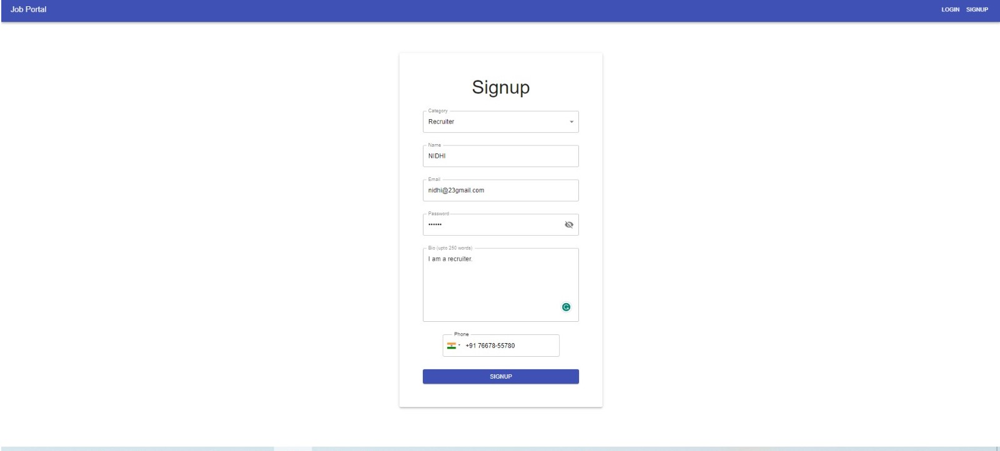
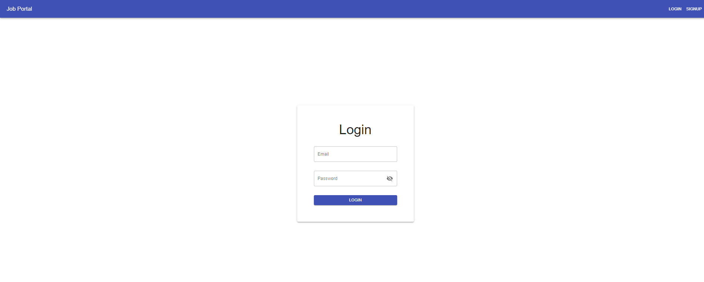
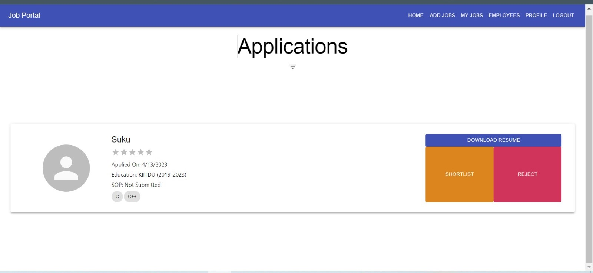
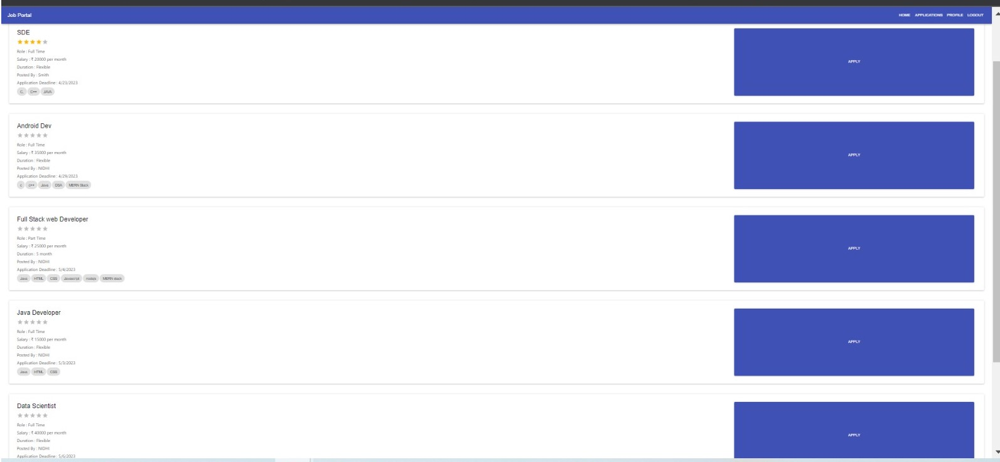
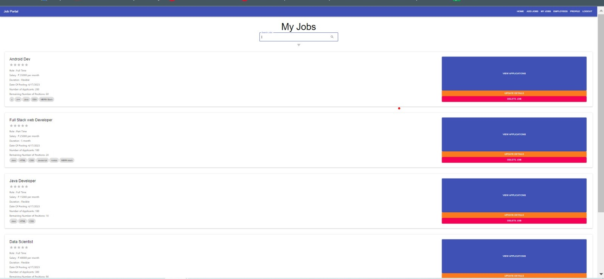
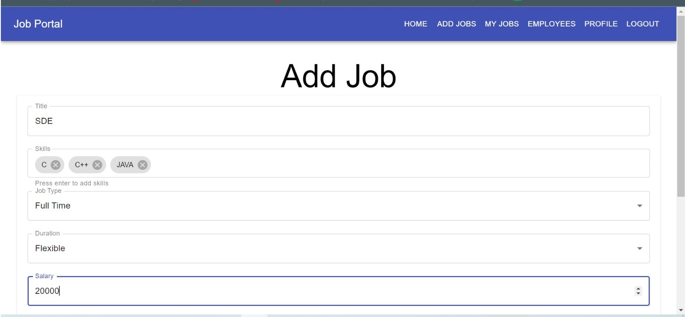

# 💼 Job Portal - MERN Stack Application

A full-featured Job Management System built with the **MERN Stack (MongoDB, Express, React, Node.js)**. This web application streamlines the job application process, offering robust features for **applicants** and **recruiters** alike.

Users can sign up as either **Applicants** or **Recruiters**, and based on their role, they can create, apply, manage, and track job opportunities. Persistent login sessions and secure **JWT-based authentication** ensure security and reliability.

---

## 🚀 Features

### 👤 Applicants
- Sign up and login securely
- Fuzzy search for jobs with filters
- Apply to jobs with custom SOPs
- View application status
- Upload resume & profile picture
- Edit profile information

### 🧑‍💼 Recruiters
- Post, update, or delete jobs
- View and manage applications
- Shortlist, accept, or reject candidates
- View applicant resumes
- Edit recruiter profile

---

## 🖼️ Screenshots

### 🔐 Sign Up Page


### 🔑 Login Page


### 📄 Applications Dashboard


### 🗂️ Jobs Listing


### 📋 My Posted Jobs


### 📝 Job Posting Form


> ⚠️ Replace these placeholders with your own hosted images from GitHub or an image CDN.

---

## 📁 Project Structure

```bash
Job_Management/
├── backend/                  # Node.js + Express + MongoDB server
│   ├── public/
│   │   ├── profile/          # User profile pictures
│   │   └── resume/           # Uploaded resumes
│   ├── server.js             # Entry point
│   └── package.json          # Backend dependencies
├── frontend/                 # React app
│   ├── src/                  # React source code
│   └── package.json          # Frontend dependencies
├── README.md
